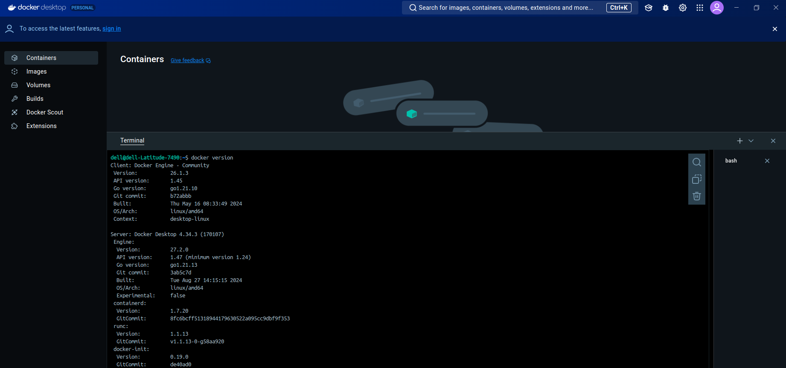

### Day 2 Assignments

> [!NOTE]
> Pls edit this table while submitting the assignments

| Status         | Questions     | 
|----------------|---------------|
| <ul><li>- [ ] </li></ul> | [Docker Desktop] Install Docker Desktop and verify the command “docker version” |
| <ul><li>- [ ] </li></ul> | [K8S] Enable K8S.Install Kubectl.Verify the command “kubectl version” |
| <ul><li>- [ ] </li></ul> | [Impromptu Learning] Complete the learning (as video / pdf) about the following two topics, read about Kubernetes, and then share a screenshot along with a summary of the story |
| <ul><li>- [ ] </li></ul> | [K8s] Write a manifest for hello-world pod and deploy the same in the namespace of your registration number |
| <ul><li>- [ ] </li></ul> | [K8s] Can you deploy a Hello World application in Kubernetes, create a Deployment, expose it using a Service, and verify the output by accessing it in a browser? Please include screenshots of each step and the final browser check. |
| <ul><li>- [ ] </li></ul> | [K8s] Can you deploy a Machine Learning application in Kubernetes, create a Deployment, expose it using a Service, and verify the output by accessing it in a browser? Please include screenshots of each step and the final browser check.  |
| <ul><li>- [ ] </li></ul> | Commit the code to the Github Repo. The repo should be a public one. And raise a PR to this repo: https://github.com/SanthoshNC/22AM0XE-Assignments |
| <ul><li>- [ ] </li></ul> | Document all the learnings with screenshots in GitHub Wiki / .md file provided in the repo: https://github.com/SanthoshNC/22AM0XE-Assignments |
| <ul><li>- [ ] </li></ul> | Create a post in Linkedin by mentioning all these details and tag the below mentioned IDs |

***

### Day 2 Assignments - Answers and Screenshots

> [!WARNING]
> Pls submit the correct screenshots

> [!CAUTION]
> Pls don't copy from others. Marks will be reduced for both students

#### #1 [Docker Desktop] Install Docker Desktop and verify the command “docker version”.
> Add your answer here!
> 

***

#### #2 [K8S] Enable K8S.Install Kubectl.Verify the command “kubectl version”
> Add your answer here!
> 

***

#### #3 [Impromptu Learning] Complete the learning (as video / pdf) about the following two topics, read about Kubernetes, and then share a screenshot along with a summary of the story
> Add your answer here!
> 

***

#### #4 [K8s] Write a manifest for hello-world pod and deploy the same in the namespace of your registration number
> Add your answer here!

***

#### #5 [K8s] Can you deploy a Hello World application in Kubernetes, create a Deployment, expose it using a Service, and verify the output by accessing it in a browser? Please include screenshots of each step and the final browser check.
> Add your answer here!

***

#### #6 [K8s] Can you deploy a Machine Learning application in Kubernetes, create a Deployment, expose it using a Service, and verify the output by accessing it in a browser? Please include screenshots of each step and the final browser check.
> Add your answer here!

***

#### #7 Commit the code to the Github Repo. The repo should be a public one. And raise a PR to this repo: https://github.com/SanthoshNC/22AM0XE-Assignments
> Add your answer here!
>
>
> https://github.com/SanthoshNC/22AM0XE-Assignments/pull/41
***

#### #8 Document all the learnings with screenshots in the GitHub Wiki / in .md file
> Add your answer here!
>
> https://github.com/Thedshanya/22AM0XE-Assignments/blob/7376221CD155/Thedshanya/takeaway.md

***

#### #9 Create a post on Linkedin about your learning journey in this 1 credit course
> Add your answer here!

https://www.linkedin.com/feed/update/urn:li:ugcPost:7254902611034681344/
***
